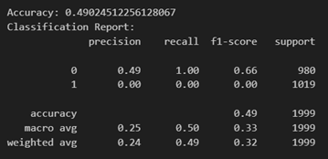
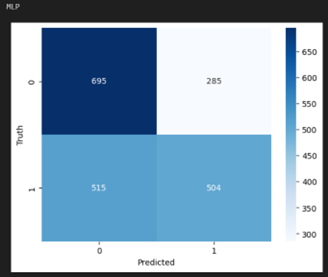

# Membership Inference Attacks on Sequence-to-Sequence Models: Is My Data In Your Machine Translation System?

## Echipa

- Farhad Ali Irinel Gul, 344C1
- Eduard Petcu, 344C1

## Atacul reprodus în cadrul lucrării

Atacul reprodus este unul de tip Membership inference și se axează pe modele de tip  Sequence-to-Sequence (în cazul nostru, un model de traducere din limba germană în limba engleză) [1]. Avem un set de date și un model de tip black-box care se antrenează pe acesta, și vrem să aflăm dacă un atacator ce deține o parte din datele pe care s-a antrenat modelul, poate determina care sample face parte din setul de date de antrenare. Pentru a putea realiza această observație, avem nevoie de un third-party neutru (numit „Carol”) care să dețină ambele perspective. Întrucât acesta are acces la anumite sample-uri folosite la antrenarea modelului de traducere, poate să încerce să diferențieze pe viitor sample-uri folosite de cele neutilizate la antrenare. 

Dacă încercarea se materializează și acesta poate propune un model de clasificare binară care să separe sample-urile atunci putem spune că modelul de traducere nu este sigur, întrucât se pot face astfel de observații. 
Fiind 2 părți implicate, „Alice” ca fiind modelul și „Bob” atacatorul, interesul lui Alice este acela ca Bob să nu poată face distincția între sample-uri folosite / nefolosite la antrenare prin inferențe repetate iar interesul lui Bob este acela de a realiza acest lucru. 

În realitate, Bob nu este neapărat personajul negativ, întrucât intenția acestuia poate fi aceea de a limita folosirea datelor private de către Alice. Analiza efectuată va fi din perspectiva lui Carol, care deține informații despre Alice și despre Bob. 

## Ipoteza

Nu se poate realiza un model de clasificare binară care să facă perfect distincția între sample-uri folosite și nefolosite la antrenarea unui model Sequence to Sequence (utilizând LSTM în cazul nostru) pe baza observării nivelului de acuratețe în traducere (BLEU Score) [2]. În cele ce urmează, vom analiza această ipoteză, construind mai multe modele de clasificare binară în jurul rezultatelor obținute din cadrul modelului de traducere.

## Relevanța practică

Această temă poate fi relevantă din perspectiva unui autor a cărui texte sunt / pot fi folosite în antrenarea unui model fără permisiunea acestuia, încălcându-se astfel drepturile de autor.

Un alt motiv, enunțat și în paperul dat spre analiză, este utilizarea datelor introduse în serviciul de machine learning cu alt scop decât cel pentru care a fost intenționat: clientul trebuie să aibă încredere în furnizor că acesta nu va folosi în scop negativ datele oferite de Bob, însă acest nivel de încredere nu poate fi verificat în niciun fel. Astfel, o soluție pentru această problemă ar fi să observăm cum se comportă modelul de folosit atât pe date care fac parte cât și pe date care nu fac parte din setul de antrenare al acestuia. 

În realitate, experimentul nu este chiar realizabil întrucât implică deținerea de colecții de date folosite în antrenarea modelului (care de obicei sunt private).

## Verificarea corectitudinii datelor

Pentru modelul antrenat de Alice, am ales traducerea din limba germană în limba engleză (asemănător alegerii din paper) întrucât pe această pereche se găsesc cele mai multe dataseturi. Tot pe acest tuplu s-au demonstrat cele mai mari BLEU scoruri (Bilingual Evaluation Understudy Score) [3] în comparație cu toate celelalte perechi de limbi străine. Această metrică este folosită pentru clasificatorul binar pentru a determina dacă un sample face parte din setul de antrenare al lui Alice. Analiza datelor pe care am făcut-o imită interpretarea realizată în lucrarea lui Sorami Hisamoto.


## Reproducerea atacului

Din păcate, nu am avut acces la modelul folosit pentru realizarea paper-ului [4], de aceea am antrenat noi unul de la 0 cu un dataset public [5].
Am ales să antrenăm în diverse scenarii acest model:


Pe scurt, modelul este compus din următoarele layere:

-	Embedding Layer: convertește din tokeni / cuvinte în vectori de dimensiune fixă
-	LSTM [6] - encoder: procesează secvența de intrare, capturând informații secvențiale
-	Repeat Vector: mărește dimensiunea datelor pentru a putea intra în următorul layer
-	LSTM - decoder: generează secvența de ieșire
-   Time Distributed: produce probabilități finale pentru fiecare cuvânt, layer wrapper pentru LSTM

Din cauza limitărilor hardware, a trebuit să ne structurăm analiza, alegând un subset din dataset pentru a obține un traducător cât de cât funcțional. Intenția noastră nu este aceea de a obține un model aproape perfect de traducere ci să facem analiză asupra lui.

Pentru a nu invoca „coincidența” în rezultatele noastre, am testat mai multe scenarii: model subantrenat (antrenat puțin pe un set de date limitat), antrenat suficient pe un subset de date dar și antrenat prea mult pe un subset mai mic de date (overfit). Am dorit să ilustrăm faptul că ipoteza noastră ține indiferent de gradul de antrenare al modelului. Pentru a reproduce atacul, am folosit un model bazat pe LSTM pe care l-am antrenat pe mai multe traduceri din germană în engleză. 

Pentru comparația mai multor outcome-uri, am split-uit diferit datasetul in rulări diferite. După care am folosit mai multe modele de clasificare binara (Naive Bayes, Random Forest, Nearest Neighbour, Perceptron, Multi-layer Perceptron (MLP), Decision Tree cu număr de sample-uri din dataset folosite la antrenare egal cu numărul de sample-uri nefolosite la antrenarea modelului de traducere. În “df” stocăm propoziția în germană, traducerea originală, traducerea obținută prin inferare, BLEU score generat în urma evaluării traducerii și label-ul final care este 0 dacă nu a fost folosit la antrenare și 1 dacă a fost folosit. 

Pasul actual este să învățăm modelul de clasificare binară să facă o distincție clară între sample-urile folosite la antrenare față de cele nefolosite. Scopul acestui pas este acela de a încerca să combatem ipoteza acestei lucrări. În cazul în care reușim în unul din scenarii să obținem un model de clasificare binară care face clară distincția (acuratețe mare) atunci ipoteza este invalidată. În caz contrar, ipoteza se menține mai departe și este aplicabilă și pe modelul antrenat de noi, deci acesta este protejat în fața atacurilor de membership inference.
Semnificația acurateții modelului de clasificare binară este următoarea:  dacă acuratețea este în jur de 50%, clasificarea binară este echivalentă cu a fi aleatorie și atunci modelul de traducere este în siguranță din punct de vedere al atacurilor de membership inference, adică nu se poate trage o concluzie privind folosirea anumitor date în procesul de antrenare cu certitudine.
Dacă acuratețea este cu mult peste 50%, atunci putem determina dacă un anumit sample a fost sau nu folosit în cadrul procesului de antrenare și deci avem o breșă de securitate în modelul de traducere, în contradicție totală cu ipoteza noastră.
Mai este și cazul în care se obține o acuratețe de sub 50%, doar că acest caz duce modelul de clasificare binară într-o poziție în care nu are rata de predicție deloc relevantă, și astfel orice observație obținută de pe urma acestuia este nulă.

### Antrenare pe cluster

```
srun -p xl --gres gpu:2 -A student --cpus-per-task=8 --mem-per-cpu=16G --time 0-23 --pty /bin/bash

singularity run --nv docker://tensorflow/tensorflow:latest-gpu


```

### Model traducere 1: 

- Training set: 38000
- Test set: 12000
- Model clasificare: Training set: 80 % din 20000 (dintre care 10000 folosite la antrenarea modelului de traducere si 10000 nu)
- Test set: 20%

Descrierea modelului: Mai puțin antrenat (repetări) pe un set de date mai mare (10 Epochs, 64 batch_size pe 38000 propoziții)


#### Naive Bayes


#### Random Forest


#### Nearest Neighbour


#### Perceptron


#### Multi-layer Perceptron (MLP)


### Model traducere 2:

- Training set: 14000
- Test set: 6000
- Model clasificare: Training set: 80 % din 10000 (dintre care 5000 folosite la antrenarea modelului de traducere si 5000 nu)
- Test set: 20%


#### Naive Bayes




#### Random Forest


#### Nearest Neighbour


#### Perceptron


#### Multi-layer Perceptron (MLP)




## Bibliografie

[1] Sorami Hisamoto, Matt Post, Kevin Duh; Membership Inference Attacks on Sequence-to-Sequence Models: Is My Data In Your Machine Translation System?. Transactions of the Association for Computational Linguistics 2020; 8 49–63. doi: https://doi.org/10.1162/tacl_a_00299

[2] https://www.digitalocean.com/community/tutorials/bleu-score-in-python

[3] https://machinelearningmastery.com/calculate-bleu-score-for-text-python/

[4] https://github.com/sorami/TACL-Membership

[5] https://valueml.com/german-to-english-translator-using-keras-and-tensorflow-using-lstm-model/

[6] https://machinelearningmastery.com/time-series-prediction-lstm-recurrent-neural-networks-python-keras/
